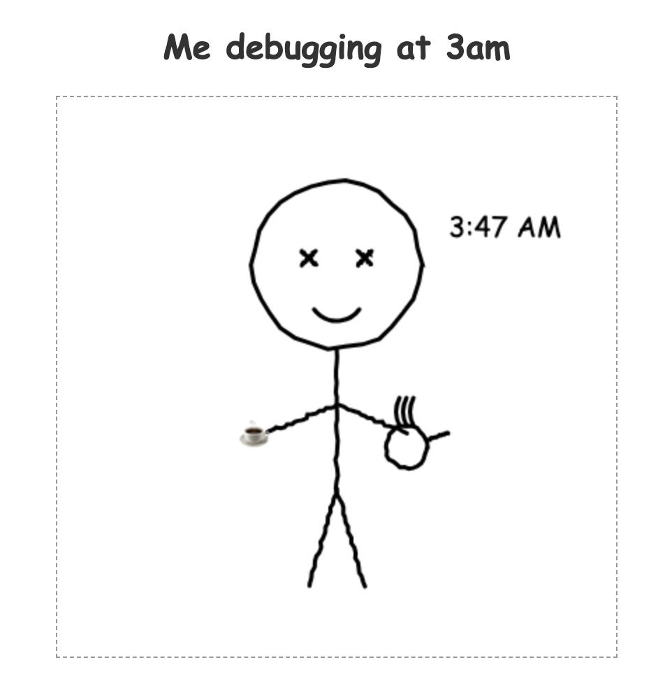
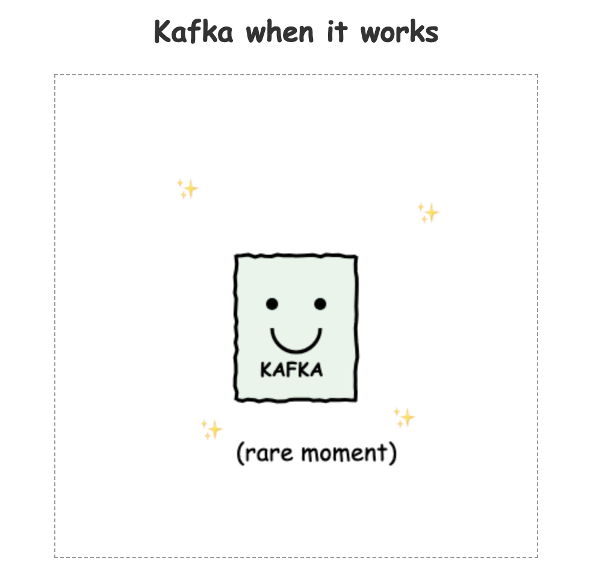
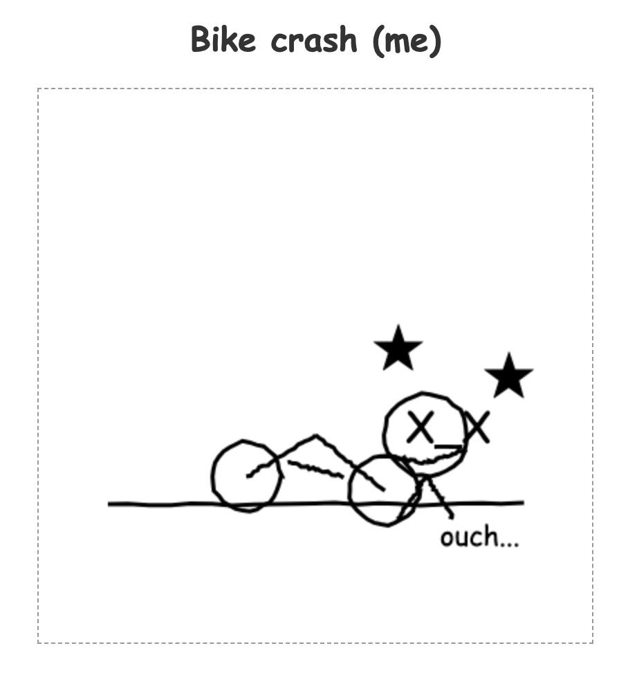
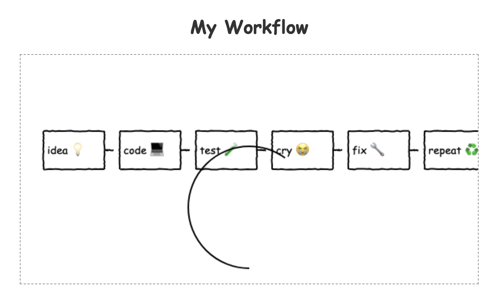

# 👋 Hi, I'm Jesús

My personal sandbox where I break things and sometimes fix them

## 🛠️ Skills
- Cooking (usually edible)
- Crash my bike (expert level) 🚴‍♂️💥
- Kafka (when it works)
- Data (I make it stream)

## 📊 My Workflow

## 💬 Quote of the day
_"If it works, don't touch it"_ - Me, 5 minutes before touching it

---
> ⚠️ Warning: This profile may contain code that works for unknown reasons

      
